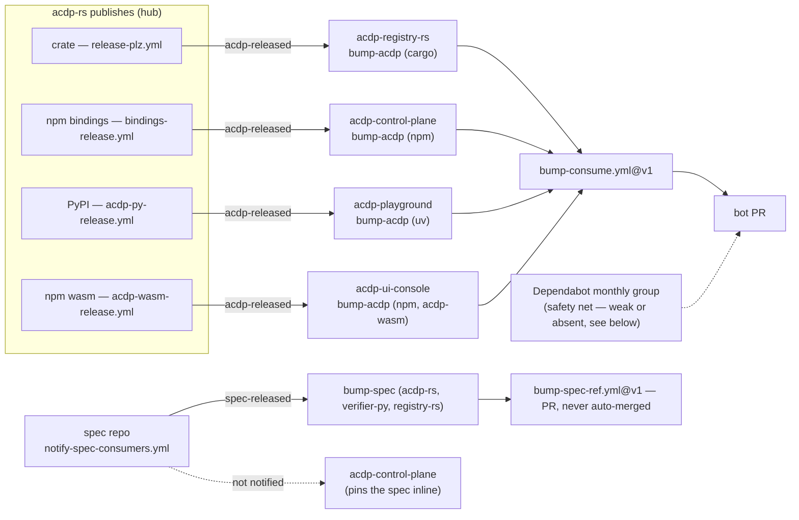
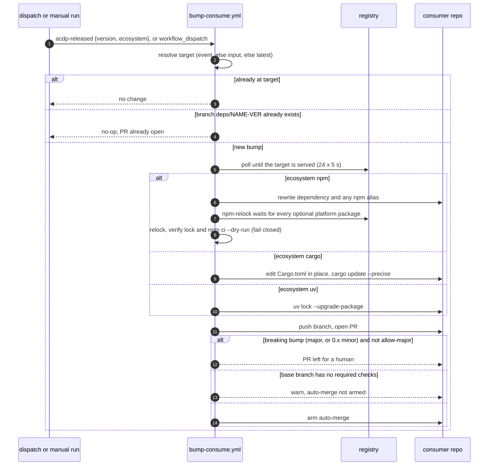
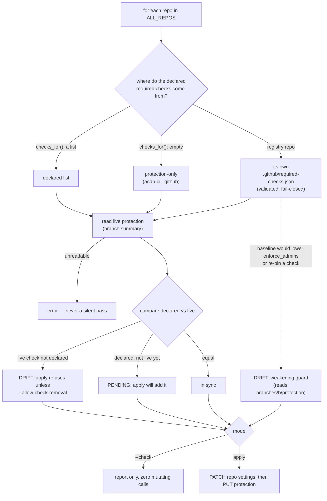

# ACDP Delivery Standard

The uniform CI/CD model for every `acdp-*` repository. Where repos legitimately
differ (build toolchain, publish target), that difference is called out and
kept local; everything else is shared here.

## Publish topology

`acdp-rs` is the hub. It publishes four packages via four independent
workflows (one push-triggered, three tag-triggered), each with its own
registry credential:

| Package | Workflow (in acdp-rs) | Trigger | Registry | Credential |
|---|---|---|---|---|
| `acdp` crate | `release-plz.yml` | push to `main` | crates.io | `CARGO_REGISTRY_TOKEN` |
| `@agentcontextdistributionprotocol/acdp` (NAPI) | `bindings-release.yml` | tag `acdp-node-v*` | npm | `NPM_TOKEN` |
| `acdp` wheels | `acdp-py-release.yml` | tag `acdp-py-v*` | PyPI | OIDC (no token) |
| `@agentcontextdistributionprotocol/acdp-wasm` | `acdp-wasm-release.yml` | tag `acdp-wasm-v*` | npm | `NPM_TOKEN` |

### Provenance is attestation-anchored, not publish-anchored

The invariant a consumer bump relies on, for the npm and PyPI **binding**
packages: **a consumer bump requires a published artifact carrying a
verifiable provenance attestation binding it to a commit, plus a release tag
at that commit.** The attestation — not a `gitHead` field in the published
manifest, which is self-asserted — is the proof. How to verify it, per
registry, is owned by `acdp-rs`:
[supply-chain: verifying a released artifact](https://github.com/agentcontextdistributionprotocol/acdp-rs/blob/main/docs/supply-chain.md#1-verifying-a-released-artifact-came-from-this-repo).

**Exception: the `acdp` crate has no attestation mechanism.** `cargo publish`
has no build-provenance equivalent of npm `--provenance` or PyPI attestations
(see [supply-chain: crates.io](https://github.com/agentcontextdistributionprotocol/acdp-rs/blob/main/docs/supply-chain.md#cratesio-acdp-and-the-workspace-crates)).
`acdp` is still a real consumer-bump path — `acdp-registry-rs` bumps it via
`bump-consume.yml@v1` with `ecosystem: cargo` — so a cargo bump is anchored by the
release-plz tag alone.

The three binding-release workflows also accept `workflow_dispatch`, and a
non-dry-run dispatch pushes a real tag and publishes with an attestation, exactly
like a tag push; a `dry_run: true` dispatch produces neither and is never a
release. What triggers each release, and how a tag/dispatch maps to a publish, is in the
[release runbook](https://github.com/agentcontextdistributionprotocol/acdp-rs/blob/main/docs/release-runbook.md#how-releases-are-triggered).

**Limit: builds are not guaranteed bit-reproducible**, so the guarantee rests on
the attestation, not on independent rebuilding; the trust root is the attested
GitHub Actions builder identity. The `acdp-wasm` artifact is covered by a determinism
gate described in the runbook's
[reproducibility section](https://github.com/agentcontextdistributionprotocol/acdp-rs/blob/main/docs/release-runbook.md#reproducibility-of-the-acdp-wasm-artifact)
(the earlier "wasm-pack unpinned" concern, `acdp-rs#196`, is closed).

`bump-consume.yml` (this repo) only *propagates* whatever a registry serves — it
cannot independently confirm an attestation on a consumer's behalf.

## Propagation graph



`release-plz.yml` also dispatches the three binding workflows (`bindings-release`,
`acdp-py-release`, `acdp-wasm-release`) via `workflow_dispatch` for a real release;
see the runbook's
[dispatch matrix](https://github.com/agentcontextdistributionprotocol/acdp-rs/blob/main/docs/release-runbook.md#release-dispatch-matrix).

The wasm lane is the fourth consumer lane: it publishes the *distinct* package
`@agentcontextdistributionprotocol/acdp-wasm` (tag namespace `acdp-wasm-v*`), not
`@agentcontextdistributionprotocol/acdp`, but `bump-consume.yml` is generic over
`package`, so `acdp-ui-console`'s `bump-acdp.yml` calls it unchanged with
`ecosystem: npm` and that package name.

Each publish job fires `repository_dispatch: acdp-released` (payload
`{version, ecosystem}`, with `ecosystem` the bump-consume value — `cargo`, `npm`,
`uv`) at its consumer using an `acdp-deps-bot` App token. The consumer's
`bump-acdp.yml` calls `bump-consume.yml`.

**Dependabot as a safety net is uneven** (each consumer owns its own
`.github/dependabot.yml`; read those, not a copy here):
[`acdp-registry-rs`](https://github.com/agentcontextdistributionprotocol/acdp-registry-rs/blob/main/.github/dependabot.yml)
covers `acdp` through its cargo catch-all groups;
[`acdp-control-plane`](https://github.com/agentcontextdistributionprotocol/acdp-control-plane/blob/main/.github/dependabot.yml)
has a dedicated `acdp-sdk` group whose own comment says Dependabot rarely proposes the
dep — a weak, unproven net;
[`acdp-ui-console`](https://github.com/agentcontextdistributionprotocol/acdp-ui-console/blob/main/.github/dependabot.yml)
ignores `acdp-wasm` 0.x minors on purpose (`acdp-ui-console#136`), so a minor only arrives
through the dispatch; and
[`acdp-playground`](https://github.com/agentcontextdistributionprotocol/acdp-playground/blob/main/.github/dependabot.yml)
`ignore`s `acdp` by name, by design — it has **no** net.

**Former gaps, all closed (2026-09-25 → 09-27).** Two of `acdp-rs`'s publish workflows
(`bindings-release`, `acdp-py-release`) used to gate their `acdp-released` dispatch on
`push` alone, so every `release-plz`-driven release (which uses `workflow_dispatch`) skipped
the notification; `acdp-playground` and `acdp-control-plane` fell many minor versions behind
before anyone noticed
([acdp-rs#302](https://github.com/agentcontextdistributionprotocol/acdp-rs/issues/302),
[#304](https://github.com/agentcontextdistributionprotocol/acdp-rs/issues/304) — closed; both
now gate on `push || !inputs.dry_run`). The wasm lane had no dispatch step at all until
[acdp-rs#307](https://github.com/agentcontextdistributionprotocol/acdp-rs/issues/307) /
`#308`, and `acdp-ui-console` gained its `bump-acdp.yml` in
[acdp-ui-console#107](https://github.com/agentcontextdistributionprotocol/acdp-ui-console/pull/107).
Verified live 2026-10-05: dispatches on 2026-09-25 and 2026-10-03/04 each triggered the
consumers' `bump acdp` workflows. How the gap was read is in
`plans/cross-repo/acdp-rs-release-dispatch-gap.md`.

Leaves — no SDK dependency, so no `bump-acdp`:

- **acdp-verifier-py** — independent second implementation of the verification
  core (for spec Final promotion); standardized (CI + auto-merge + Dependabot). Its
  independence from `acdp-rs` is the point — see its
  [independence claim](https://github.com/agentcontextdistributionprotocol/acdp-verifier-py/blob/main/README.md#independence-claim).
- **acdp-website** — Vercel deploy, no family SDK dependency. **Not** managed by
  `standardize.sh`: it is a private repo where branch protection and rulesets both
  403 (an explicit `EXCLUDED_REPOS` entry), so it carries no required checks from here.

`acdp-ui-console` is *not* in this list either — it is a **fourth consumer**, the
second npm one: `package.json` depends on `@agentcontextdistributionprotocol/acdp-wasm`
and its `bump-acdp.yml` receives the wasm dispatch (see the known-gap section above).
Two things differ from the others: the package and tag namespace are `acdp-wasm` /
`acdp-wasm-v*`, and its 0.x minors are held from Dependabot (`acdp-ui-console#136`) and
from unattended merge here (`bump-consume.yml` treats a `0.x` minor as breaking, so only
patch bumps arm auto-merge); a real-binary `wasm-fixtures` test gates them.

## Propagation mechanics

Two propagation lanes, both event-driven, both App-authenticated. Dependabot's role as a
safety net differs per lane and per consumer — see the propagation-graph section above,
not repeated here.

### SDK propagation (a new `acdp` package → its consumers)

1. `acdp-rs` publishes (`release-plz` crate / `bindings-release` npm tag /
   `acdp-py-release` PyPI tag / `acdp-wasm-release` npm tag). Each publish job, on a
   real publish, mints an App token scoped to the consumer and POSTs
   `repository_dispatch: acdp-released` with `client_payload {version, ecosystem}`.
   Which workflow notifies which consumer, and when it fires, is `acdp-rs`'s to document:
   [release dispatch matrix](https://github.com/agentcontextdistributionprotocol/acdp-rs/blob/main/docs/release-runbook.md#release-dispatch-matrix).
2. The consumer's thin `bump-acdp.yml` calls `bump-consume.yml@v1`:



   The npm path matters most: a release publishes the main package before its
   platform packages, and an unverified relock in that window silently drops them
   (acdp-ci#28), so a bad lock now fails the bump job instead of opening a red PR (see
   [`actions/npm-relock`](actions/npm-relock/README.md)). The consumer's `.nvmrc` /
   `.node-version` picks the Node version (the `node-version` input, default `22`, is the
   fallback) so the lock is written by the same npm major as its CI. `cargo` preserves
   `features` and is virtual-workspace-safe.
3. Missed dispatch → Dependabot's monthly `acdp` group opens the same PR later
   (`acdp-playground` excepted — see the propagation-graph section above).

### npm aliases are forbidden for family packages

Family packages (`@agentcontextdistributionprotocol/*`) MUST be declared under
their real scoped name in a consumer's `package.json` — never behind an npm
alias specifier (e.g. `"acdp": "npm:@agentcontextdistributionprotocol/acdp@^0.8.1"`).

**Why (verified, not the originally-hypothesized reason)**: `bump-consume.yml`'s
own npm rewrite loop already handles an aliased entry correctly — its `else if`
branch (the `npm:` alias branch of the rewrite loop) matches `d[k].startsWith("npm:"+pkg+"@")`
against **every** key in the dependency section, not just `k===pkg`, so the fast
dispatch path rewrites an alias's value regardless of what its own key is named.
The actual risk is the *safety net*: Dependabot's monthly sweep — which exists
specifically to catch a missed `bump-consume` dispatch — does not reliably
follow `npm:` alias specifiers, so an aliased family dependency can silently
desync whenever the fast path is missed and only the safety net fires. This is
what actually broke `acdp-control-plane`'s CP-1 (commit `ffb3a99`): the fix
collapsed a stale-vs-fresh duplicate down to the alias, not away from it,
leaving the repo still exposed to the same recurrence. Forbidding the alias
pattern removes the one path (Dependabot) that doesn't handle it correctly,
which is strictly cheaper than teaching Dependabot's alias handling (not
`acdp-ci`'s to configure) or adding a second alias-resolution code path.

A one-time, read-only sweep of every npm-consuming sibling repo
(`acdp-ui-console`, `acdp-website`, `acdp-control-plane`) was done during CI-4
(Phase 2): `acdp-control-plane` had this violation as its sole declaration of the
family SDK at sweep time, tracked via
[acdp-control-plane#123](https://github.com/agentcontextdistributionprotocol/acdp-control-plane/issues/123)
and `plans/cross-repo/acdp-control-plane-dealias-acdp.md`. As of 2026-09-05
the alias has been removed and #123 is closed (see the CI baseline section
below) — kept here as the historical sweep record, not a live violation.
This rule is a standing statement of intent, not an enforced CI gate — nothing
here catches a *new* alias added after this rule ships.

### Spec propagation (a new spec revision → its SHA-pinners)

The spec (`agentcontextdistributionprotocol`) is a **dependency pinned by git
SHA** in consumers' CI. **The rule: every repo whose CI consumes the spec MUST
check it out at a 40-hex commit SHA** — never an unpinned/default-branch
checkout. That's satisfiable two ways: adopt
[`acdp-ci/actions/checkout-spec`](actions/checkout-spec/README.md), SHA-pinned
(the recommended path — see what it additionally buys, below; see the
Ruling below for how to pin the action itself), or pin the SHA
directly with the inline pin shape (a raw `actions/checkout` step against
the spec repo, with an explicit 40-hex `ref:`). Adoption of a new SHA is
always a reviewed PR, never auto-merged (below).

Which repos pin the spec, and how, as of 2026-10-09 (each repo's `ci.yml`, and
`mutants.yml` where present, is authoritative — read it rather than trusting this
snapshot): `acdp-verifier-py` and `acdp-registry-rs` (both its `ci.yml` and
`mutants.yml`) use the composite action; `acdp-rs` pins inline in `ci.yml` **and**
`bindings.yml` (its own `bump-spec.yml` opens a companion PR for the second pin);
`acdp-control-plane` pins inline in `ci.yml` and has **no** `bump-spec` caller. Every
pin is a 40-hex SHA; only the mechanism differs.

**Notification gap (a decision, not an accident):** the spec repo's
[`notify-spec-consumers.yml`](https://github.com/agentcontextdistributionprotocol/agentcontextdistributionprotocol/blob/main/.github/workflows/notify-spec-consumers.yml)
dispatches `spec-released` only to `acdp-rs`, `acdp-verifier-py` and `acdp-registry-rs`.
`acdp-control-plane` pins the spec but is not notified, so its pin moves only when
someone bumps it by hand (its `ci.yml` comment records the last bump). The spec's
versioning and release rules are in
[`VERSIONING.md`](https://github.com/agentcontextdistributionprotocol/agentcontextdistributionprotocol/blob/main/VERSIONING.md#release-tags) and
[`RELEASE.md`](https://github.com/agentcontextdistributionprotocol/agentcontextdistributionprotocol/blob/main/RELEASE.md); RFC lifecycle in
[`rfcs/README.md`](https://github.com/agentcontextdistributionprotocol/agentcontextdistributionprotocol/blob/main/rfcs/README.md).

Adopting the action buys two guards the inline shape doesn't have: it
verifies the `ref:` input is 40 hex characters before checking anything out
(a non-40-hex ref — e.g. a branch name — is rejected rather than silently
checked out as "pinned"), and it refuses the combination `set-env: false` +
`require-conformance: true` (the default), which would otherwise export
`ACDP_REQUIRE_CONFORMANCE` without `ACDP_SPEC_DIR` — a hard failure in the
test suites (e.g. `acdp-rs`'s) that read that var.

This rule pins one thing — the **spec ref** itself. A second, independent
pin is **how a caller references the `checkout-spec` action**: `@v1` (a
mutable major tag) or a full commit SHA with a trailing `# v1` comment.
**Ruling: callers MUST pin `checkout-spec` by full commit SHA, with a
trailing `# v1` comment kept for human readability** — e.g.
`agentcontextdistributionprotocol/acdp-ci/actions/checkout-spec@015910153b61c32abbe018afe85d44868897bf3b  # v1`.
`@v1` is no longer the documented shape for this action. The two adopters
(`acdp-verifier-py`, `acdp-registry-rs`) are already SHA-pinned this way, so the
mandate cost no migration.

`acdp-ci`'s `main` is protected (by `scripts/standardize.sh`, protection-only: no
required checks), and has **no CI of its own** — every workflow here is either `workflow_call`-only
(`auto-merge.yml`, `bump-consume.yml`, `bump-spec-ref.yml`) or
`schedule`/`workflow_dispatch`-only (`drift-check.yml`), so `main` produces
zero check-runs from its own PRs (the reason `scripts/standardize.sh`
manages this repo protection-only — see Releasing `acdp-ci` below). `v1` is
force-moved to wherever `main` points, wholesale, with no filtering by
change type — even a docs-only merge retags it. Binding a caller to `@v1`
therefore binds it to an untested, admin-bypass-moved pointer, not to
anything resembling a release. A bad retag also reds every `@v1` adopter
simultaneously with no local commit to bisect; SHA-pinning turns that into
**containment** — a bad retag reds nobody, since no caller resolves the
mutable tag at build time — which is the primary justification, because it
holds even with no Dependabot configured at all. The trailing `# v1`
comment does **not** drive Dependabot's recognition of the pin — Dependabot
parses the `uses:` line itself regardless of any comment; the comment is
preserved purely as a human-readable annotation of which major the pinned
SHA corresponds to. A Dependabot-driven catch-up bump is a real but
*secondary* and, so far, **unverified** path: `acdp-ci` has exactly one tag
(`v1`) and no releases, so today the only PR Dependabot could ever open
against this pin is `v1 → v1` at a different SHA — no version delta — and
that path has never fired in this org. `acdp-verifier-py` is the sharpest
case for pinning regardless of any Dependabot mechanics — its CI gates spec
Final promotion, so a fleet-wide simultaneous break is costliest there. It
also matches this repo's own risk grading elsewhere (SHA-pin third-party
actions, tag-trust first-party `actions/*` — see Conventions in
`README.md`): a cross-repo action maintained by one person, sitting behind
a force-moved tag, reads closer to the third-party profile than to
`actions/checkout@v4`.

1. On a conformance-relevant push, the spec repo's `notify-spec-consumers.yml`
   (path filter and target list live there) dispatches
   `repository_dispatch: spec-released {sha}` to each notified pinner.
2. The pinner's `bump-spec.yml` calls `bump-spec-ref.yml@v1`, which rewrites the
   pinned `ref:` in the target workflow file and opens a PR that is **never
   auto-merged** — the PR's own conformance CI runs against the new fixtures, and
   a human adopts the new spec deliberately (the pin exists precisely so spec
   changes never silently alter CI). `bump-spec-ref.yml` understands both the
   inline pin shape below and the `checkout-spec` action's pin shape.

#### Adopting `checkout-spec` in a new consumer repo

Add the `checkout-spec` step **after your own repo's checkout**, pinned by SHA as ruled
above. The exact step, the input/output reference and the ordering rule live in the
[action's README](actions/checkout-spec/README.md) — the one copy of that usage block.

Then add a thin `bump-spec.yml` caller so a spec release reaches this repo
automatically:

```yaml
name: bump spec
on:
  repository_dispatch:
    types: [spec-released]
  workflow_dispatch:
    inputs:
      sha:
        description: 'Spec SHA to adopt (blank = spec HEAD)'
        required: false
        default: ''
jobs:
  bump:
    uses: agentcontextdistributionprotocol/acdp-ci/.github/workflows/bump-spec-ref.yml@v1
    with:
      file: .github/workflows/ci.yml   # the file holding your checkout-spec step
      sha: '${{ github.event.inputs.sha }}'
    secrets:
      ACDP_BOT_APP_ID: '${{ secrets.ACDP_BOT_APP_ID }}'
      ACDP_BOT_PRIVATE_KEY: '${{ secrets.ACDP_BOT_PRIVATE_KEY }}'
```

**Ordering.** Your own repo's checkout must run before the `checkout-spec` step or it
wipes the spec checkout; see the action README (which also covers the `fetch-depth: 0`
remedy for an unreachable pin and the one-pin-per-file limit of `bump-spec-ref.yml`).

## Branch protection and drift detection

`scripts/standardize.sh` is the single place branch protection is defined for the
managed repos (`ALL_REPOS`; the deliberately unmanaged ones are `EXCLUDED_REPOS`, each
with a recorded reason). The required-check list is a wholesale `PUT`, so the script
first reads live protection and refuses to drop a live check it does not declare:



`--check` also enumerates the org once (default full sweep only) and reports any
non-archived repo in neither list as `UNREGISTERED`. Exit codes: **0** clean, **1** a
result (drift, pending, unregistered, unreadable repo, or a named unmanaged repo),
**2** the check could not run. `drift-check.yml` runs this weekly and files or updates one
tracking issue on exit 1, and hard-fails on exit 2. The full contract is in the
[`standardize.sh` header](scripts/standardize.sh) and
[`tests/standardize`](tests/standardize/README.md).

## Merge policy

Patch + minor auto-merge on a green pipeline; **majors are held** for a human
(Dependabot majors, and breaking SDK bumps — `major`, or a `minor` while
`0.x` — from `bump-consume`). Both workflows take `allow-major` to arm a
breaking bump anyway. `auto-merge.yml` additionally takes `exclude-dependencies`
and `exclude-groups` deny lists: a match holds the PR (e.g. for crypto-critical
dependencies) and disarms an already-armed one; deny lists only ever add holds, and
an undeterminable dependency list holds (fail-safe). The decision tree is in the
[`auto-merge-gate` README](actions/auto-merge-gate/README.md); caller examples in
the [README](README.md).

## CI baseline

Auto-merge only ships what CI vouches for, so every repo's `main` protection must
require a pipeline that meets this bar. **The principles are uniform; how each
ecosystem satisfies them is not** — do not port one repo's tooling into another
(a Rust repo's gate is clippy, not `ci-conventions.sh`).

Every repo:

- [ ] **Format** enforced, not advisory — rustfmt / ruff format / prettier
- [ ] **Lint** at zero warnings — clippy `-D warnings` / ruff / eslint `--max-warnings 0`
- [ ] **Type-check** — `tsc --noEmit` / mypy `--strict` (native to Rust)
- [ ] **Tests + coverage gate** — thresholds enforced in CI, not merely measured
- [ ] **Convention / supply-chain checks** where the repo defines them — e.g.
      control-plane `scripts/ci-conventions.sh`; acdp-rs `cargo-deny` + `cargo-vet`
      + `cargo-semver-checks`

Ships a container image → additionally:

- [ ] **`docker build` (no push) on PRs** — a broken Dockerfile fails at PR time,
      not release time
- [ ] **Boot / smoke before publish** — boot the built image (or run a
      golden-vector / conformance smoke) so an unbootable artifact never reaches
      the registry or a deploy

Consumes a family package via npm → additionally:

- [ ] **No `npm:` alias for family packages** in `package.json` — see
      [npm aliases are forbidden for family packages](#npm-aliases-are-forbidden-for-family-packages)
      above.

The jobs satisfying this bar are the **required status checks** on `main`
(configured by `scripts/standardize.sh`, which now refuses to remove a live
required check it doesn't declare; for acdp-registry-rs the declared list is read
from that repo's own `.github/required-checks.json`, validated fail-closed), so a red gate blocks the merge and
auto-merge never overrides it. acdp-rs exceeds this baseline. New SDK repos
(Java / Go / Kotlin) inherit the bar, satisfied by their own ecosystem's tools.

This bar applies to every repo that ships code — see the Repo matrix below.
`acdp-ci` and `.github` are structurally exempt, not exceptions: neither ships
application code (`acdp-ci` is CI/CD YAML + docs with zero check-runs on its
own PRs; the org `.github` repo's only workflow is its own `posture-drift.yml`,
which is not a required check), so `standardize.sh` manages them protection-only,
with no required checks to configure.
**As of 2026-09-05, every code-shipping repo meets this baseline in full.**
`acdp-control-plane` was the one tracked exception to the no-alias row above
— tracked as
[acdp-control-plane#123](https://github.com/agentcontextdistributionprotocol/acdp-control-plane/issues/123)
— but the alias has since been removed from its `package.json` and #123 is
closed, verified live against `origin/main`. No code-shipping repo currently
carries an npm alias for a family package.

`auto-merge.yml` and `bump-consume.yml` both enforce this baseline themselves,
**with different failure modes**: `auto-merge.yml` hard-fails (rather than silently
completing) on a repo whose `main` hasn't yet adopted `standardize.sh` branch
protection with at least one required status check, while `bump-consume.yml`'s
own auto-merge step (bot-authored SDK bump PRs) emits a warning and skips arming
— the PR opens either way, only the unattended merge is withheld. Note: once `acdp-ci` and
`.github` are protected via `standardize.sh`, they still have **zero**
required status checks by design (above) — so they'd still, correctly, fail
this same guard. "Protected" must not be read as "passes the auto-merge
guard." Harmless in practice today: neither repo calls `auto-merge.yml` —
`acdp-ci`'s only mention of it is a comment in the workflow's own header, and
the `.github` repo's one workflow is `posture-drift.yml`.

## Credentials

One GitHub App (`acdp-deps-bot`), installed org-wide, key stored once as org
secrets `ACDP_BOT_APP_ID` / `ACDP_BOT_PRIVATE_KEY`. Every cross-repo dispatch and
every bot PR mints a short-lived installation token from it — **zero PATs**.
Registry-publish tokens (`NPM_TOKEN`, `CARGO_REGISTRY_TOKEN`; PyPI is OIDC) stay
in `acdp-rs`.

App repository permissions:

| Permission | Why |
|---|---|
| Contents: Read/write | commit bump branches; POST `repository_dispatch` |
| Pull requests: Read/write | open the bump PRs |
| **Workflows: Read/write** | **required** for `bump-spec-ref` — the spec pin lives in `.github/workflows/ci.yml`, and GitHub blocks an App from pushing changes under `.github/workflows/` without it |
| Administration: Read | `drift-check.yml` mints a read-only token with it so `standardize.sh --check` can read `branches/{b}/protection` (the registry baseline weakening guard); never requested by any other workflow |

`bump-consume` (manifests/lockfiles) does not need Workflows; only spec-pin
propagation does — enforced, not merely asserted: `bump-consume.yml`'s
token-mint step requests only `permission-contents: write` and
`permission-pull-requests: write` from `actions/create-github-app-token`, with
no `permission-workflows` input at all, so the token it mints can never carry
Workflows scope, no matter what the App's org-wide installation grants.
`bump-spec-ref.yml`'s token-mint step is the only one that additionally
requests `permission-workflows: write`. `drift-check.yml` mints a separate
read-only token (`permission-contents: read` + `permission-administration: read`,
org-scoped via `owner:`) for `standardize.sh --check`, and uses the job's own
`GITHUB_TOKEN` (`issues: write`) only to file the tracking issue in this repo.

**Callers pass `secrets:` explicitly, naming each secret the reusable workflow
needs. `secrets: inherit` is prohibited for these reusable workflows.**
`inherit` forwards *every* org and repo secret to the callee regardless of
need, which undermines at the caller boundary exactly the mechanism the
paragraph above documents as "enforced, not merely asserted": the callee's
`permission-*` inputs can constrain what its own minted token carries, but
they cannot constrain what the caller's `secrets:` block hands it in the
first place. This rule governs only the caller's `secrets:` block — it says
nothing about the caller's `permissions:` block. Where the callee mints no
App token of its own and instead runs on the caller's own `GITHUB_TOKEN`
(`auto-merge.yml`), that caller-side `permissions:` block stays load-bearing
and must not be trimmed by analogy with this rule.

**Adoption status — resolved.** Every reusable-workflow call site in the family
(the `bump-acdp.yml` callers in `acdp-control-plane`, `acdp-playground`,
`acdp-registry-rs`, `acdp-ui-console`; the `bump-spec.yml` callers in
`acdp-verifier-py`, `acdp-rs`, `acdp-registry-rs`) passes secrets explicitly (last verified
2026-10-05); the migration ([acdp-ci#13](https://github.com/agentcontextdistributionprotocol/acdp-ci/issues/13),
`acdp-rs#199`, `acdp-registry-rs#144`) is closed.

This was a point-in-time migration, not an enforced invariant: nothing checks a
*new* reusable-workflow caller against this rule (see below), so a future caller
added with `secrets: inherit` won't be caught by anything but review. The org's
[`.github` workflow-templates](https://github.com/agentcontextdistributionprotocol/.github/tree/main/workflow-templates)
already use the explicit named-secrets shape, so a
repo newly adopting a template gets this right from the start — that doesn't
help a repo that copies an older shape by hand instead of from a template.

Nothing automated checks this. `drift-check.yml` compares declared required
status checks against live branch protection; it has no visibility into
caller `secrets:` blocks in other repos, and a green drift-check says
nothing about this rule either way.

**The `acdp-deps-bot` App's `Workflows: Read/write` is org-wide** — it can push to
`.github/workflows/**` in every repo it's installed in, `acdp-ci` included. That
is exactly the class of actor `main` branch protection (`scripts/standardize.sh`)
and the `v*` tag ruleset (below) exist to bound: neither grants the App a bypass,
so a compromised or misbehaving bot run can propose a bump PR but cannot force a
merge past protection, and cannot touch the `v1` tag at all.

## Releasing `acdp-ci` (the `v1` tag)

Every consumer resolves `acdp-ci/.github/workflows/*@v1` at that one
**mutable** tag on every run. The composite actions `actions/npm-relock` and `actions/auto-merge-gate` are
referenced at `@v1` too (by `bump-consume.yml` / `auto-merge.yml`), so they float with
the workflows and roll back with them — a workflow run from a branch or pinned by SHA
before the move cannot resolve them. `acdp-ci/actions/checkout-spec` is the
exception, by ruling (above): callers pin it by full commit SHA, so a
`checkout-spec` caller does not re-resolve `v1` on every run — it stays on
whatever SHA it last bumped to, until it deliberately bumps again. Moving
`v1` is a **human-assisted** operation — no agent or workflow ever runs
these commands. A scripted version of this runbook lives in
[`scripts/handoff/`](scripts/handoff/README.md) (`2026-10-05-move-v1.sh`: dry-run by
default, `--apply` plus a typed confirmation to move the tag); it targets
`origin/main`, whereas the runbook below targets a given PR's merge commit.
Run this **after** a PR to `acdp-ci` merges, and **before** creating/relying on
the `v*` tag ruleset below (rehearse the move first; a ruleset created before the
move has ever been exercised means the first failure mode is a rejected push
with no known-good remedy).

```sh
# 1. Record pre-move state FIRST — this is the only rollback anchor.
# NOTE: do NOT pass "v1" as a ls-remote pattern here — a refname pattern matches
# against the ref's last path component, and "v1" does not match "v1^{}", so a
# filtered `git ls-remote --tags origin v1` silently drops the peeled line you
# need. Always list unfiltered, then pick the two lines out with awk/grep.
git ls-remote --tags origin
#   <tag-object-sha>  refs/tags/v1      <- annotated tag object
#   <commit-sha>      refs/tags/v1^{}   <- commit v1 points at
OLD_V1_TAG_OBJ=$(git ls-remote --tags origin | awk '$2=="refs/tags/v1"{print $1}')
OLD_V1_COMMIT=$(git ls-remote --tags origin | awk '$2=="refs/tags/v1^{}"{print $1}')
# Do not proceed on an empty value, or step 6's rollback silently DELETES v1
# instead of restoring it (an empty $OLD_V1_TAG_OBJ makes the refspec "+:refs/tags/v1").
if [ -z "$OLD_V1_TAG_OBJ" ] || [ -z "$OLD_V1_COMMIT" ]; then
  echo "FAILED to capture pre-move state — STOP, do not proceed" >&2
  return 1 2>/dev/null || exit 1
fi
echo "OLD_V1_TAG_OBJ=$OLD_V1_TAG_OBJ  OLD_V1_COMMIT=$OLD_V1_COMMIT"
# Paste both into the PR thread.

# 2. Fetch (force, so the old tag object stays in the local object store) and identify the target.
git fetch origin main '+refs/tags/v1:refs/tags/v1'
NEW_SHA=$(gh pr view <PR_NUMBER> --repo agentcontextdistributionprotocol/acdp-ci \
  --json mergeCommit -q .mergeCommit.oid)
git log --oneline "$OLD_V1_COMMIT..$NEW_SHA"   # review EVERYTHING this move ships, not just the PR
git rev-parse origin/main                      # normally equals NEW_SHA

# 3. Verify the move is a fast-forward of the tag.
git merge-base --is-ancestor "$OLD_V1_COMMIT" "$NEW_SHA" && echo FAST-FORWARD-OK
# No FAST-FORWARD-OK => you would move v1 sideways/backwards. STOP and investigate.

# 4. Move the tag; force-push ONLY this ref. Keep it ANNOTATED.
git tag -f -a v1 -m "acdp-ci v1" "$NEW_SHA"
git push origin refs/tags/v1 --force     # equivalently: git push origin '+refs/tags/v1:refs/tags/v1'
# NEVER `git push --tags -f`: that force-pushes every local tag, silently clobbering or
# resurrecting others. The explicit refspec touches refs/tags/v1 and nothing else.

# 5. Verify. (Unfiltered again — see the note on step 1 for why "origin v1" drops
#    the ^{} line you need to check here.)
git ls-remote --tags origin   # the ^{} line for refs/tags/v1 must now show $NEW_SHA
gh api repos/agentcontextdistributionprotocol/acdp-ci/git/ref/tags/v1 -q '.object.sha'
# ^ returns the new TAG-OBJECT sha, which differs from $NEW_SHA — expected for an annotated
#   tag. Always compare the peeled ^{} line, or you will wrongly conclude the push failed.
# Smoke: re-run one consumer workflow (e.g. a consumer's `auto-merge` caller or a bump dispatch — acdp-rs no longer calls the shared `auto-merge.yml`) and confirm
# it resolves @v1 and passes.

# 6. Rollback — restores the exact original tag object (tagger/date/message included).
# NOTE: if the v* tag ruleset (below) is active, this step moves v1 BACKWARDS and is therefore
# NOT a fast-forward — non_fast_forward on the ruleset requires the bypass actor here even
# though step 4's forward move satisfied non_fast_forward on its own.
# GUARD — an empty OLD_V1_TAG_OBJ turns the refspec below into "+:refs/tags/v1", which
# DELETES v1 instead of restoring it. Never skip this check, even under pressure.
if [ -z "$OLD_V1_TAG_OBJ" ]; then
  echo "OLD_V1_TAG_OBJ is empty — STOP, re-derive it from step 1's output before rolling back" >&2
  return 1 2>/dev/null || exit 1
fi
# BRACE THE VARIABLE — in zsh (macOS's default shell), an unbraced "$VAR:refs/..."
# parses ":r" as the history-style "root" modifier and silently eats it, turning
# this into "+<sha>efs/tags/v1" — not a syntax error, just the wrong ref, and git
# rejects it with a confusing "src refspec ... does not match any". Confirmed via
# `zsh -c`. ${OLD_V1_TAG_OBJ} (braced) is unambiguous in both bash and zsh — do not
# "simplify" this back to the unbraced form.
git push origin "+${OLD_V1_TAG_OBJ}:refs/tags/v1"
git ls-remote --tags origin   # the ^{} line for refs/tags/v1 must show $OLD_V1_COMMIT again
```

**Not recoverable by rollback:** any consumer run that had already *started* resolved the new
commit and finishes on it. Actions resolves `uses: …@v1` at job start. Prefer a quiet window.

**Blast radius:** moving `v1` instantly retargets the reusable workflows consumed by all ~9
downstream repos; every consumer run that starts after the push executes the new commit, with
no staging, canary, or opt-in.

### The `v*` tag ruleset

Protects `refs/tags/v*` from deletion, force-push (`non_fast_forward`), an unreviewed
fast-forward `update`, and a spoofed `creation` — while leaving exactly one bypass: the
repository-admin role, which is not held by the `acdp-deps-bot` App (GitHub Apps cannot
inherit a `RepositoryRole` bypass — deliberate, given the App's org-wide `Workflows:write`).

```bash
# CREATE — a GitHub settings change. Run manually, after rehearsing the v1 move above.
gh api --method POST repos/agentcontextdistributionprotocol/acdp-ci/rulesets --input - <<'JSON'
{
  "name": "protect-v-tags",
  "target": "tag",
  "enforcement": "active",
  "bypass_actors": [
    { "actor_id": 5, "actor_type": "RepositoryRole", "bypass_mode": "always" }
  ],
  "conditions": {
    "ref_name": { "include": ["refs/tags/v*"], "exclude": [] }
  },
  "rules": [
    { "type": "creation" },
    { "type": "update" },
    { "type": "deletion" },
    { "type": "non_fast_forward" }
  ]
}
JSON
```

```bash
# VERIFY — mandatory. A wrong pattern (the API stores/matches the fully-qualified
# "refs/tags/v*", not the bare "v*" the UI displays) protects nothing, silently.
gh api repos/agentcontextdistributionprotocol/acdp-ci/rulesets \
  --jq '.[] | {id, name, target, enforcement}'
gh api repos/agentcontextdistributionprotocol/acdp-ci/rulesets/<RULESET_ID> \
  --jq '{name, target, enforcement, conditions, rules, bypass_actors, current_user_can_bypass}'
# Expect: conditions.ref_name.include == ["refs/tags/v*"]; current_user_can_bypass == "always".
# Also confirm the GitHub UI renders the bypass actor as "Repository admin".
# Functional smoke: the next routine forward v1 move must succeed and appear in the
# repo's rule-bypass audit view.
```

```bash
# ROLLBACK — restores today's exact state; acdp-ci has no other rulesets.
gh api --method DELETE repos/agentcontextdistributionprotocol/acdp-ci/rulesets/<RULESET_ID>
```

**Blast radius:** affects only refs matching `refs/tags/v*` in `acdp-ci`; the ~9 consumer repos
are read-side and unaffected; the sole repo admin retains full create/move/delete via
automatic, audit-logged bypass; rollback is one DELETE.

## Repo matrix

| Repo | Lang | CI caller | auto-merge | Dependabot | bump-acdp | Publish | Graph role |
|---|---|---|---|---|---|---|---|
| acdp-rs | Rust | own ci | own gate (`dependabot-auto-merge.yml`, crypto lockfile gate — not the shared `auto-merge.yml`; acdp-rs#351) | ✅ (SHA-pinned) | — | crate+npm+py+wasm | **hub / all four lanes dispatch — see propagation graph** |
| acdp-registry-rs | Rust | own ci | ✅ | cargo+ga | cargo | Docker + crate | consumes crate |
| acdp-control-plane | npm | own ci | ✅ | npm+docker+ga | npm | Docker | consumes npm |
| acdp-playground | Python/uv | own ci | ✅ | uv+ga | uv | Docker | consumes py |
| acdp-verifier-py | Python | own ci | ✅ | pip+ga | — | — | independent |
| acdp-ui-console | TS | own ci | ✅ | npm+ga | npm | Vercel | consumes wasm (`acdp-wasm`) via dispatch → `bump-acdp.yml` |
| acdp-website | MDX | own ci | n/a — excluded from `standardize.sh` (private repo; protection API 403s) | npm+ga | — | Vercel | leaf |
| agentcontextdistributionprotocol (the spec) | schemas / RFCs | own | ✅ (`auto-merge.yml@v1`), managed by `standardize.sh` | — | — | — | **spec source**; notifies `acdp-rs`, `acdp-verifier-py`, `acdp-registry-rs` via `notify-spec-consumers.yml` |
| acdp-docs | KB + MCP server | — | n/a — excluded from `standardize.sh` (private; no managed checks) | — | — | — | knowledge base; links to this repo, not a pipeline participant |
| acdp-ci | YAML/bash | n/a — also has `drift-check.yml` (`schedule`/`workflow_dispatch`) as of CI-8, but zero check-runs on its own PRs still holds | ❌ (protection-only, see `standardize.sh`) | ga (2 dirs: root + `actions/checkout-spec`) | — | — | **infra — this is the hub; every repo above consumes it at `@v1`** |
| `.github` | — | n/a — only its own `posture-drift.yml` | ❌ (protection-only, see `standardize.sh`) | — | — | — | org profile + community health files |

## Extending to new SDKs (Java / Go / Kotlin)

Add a `bump-consume` ecosystem branch (`gradle`/`go`/…) and an `acdp-rs`
publish→dispatch step. The consumer repo gets the same thin `bump-acdp.yml`
caller. Nothing else changes.
