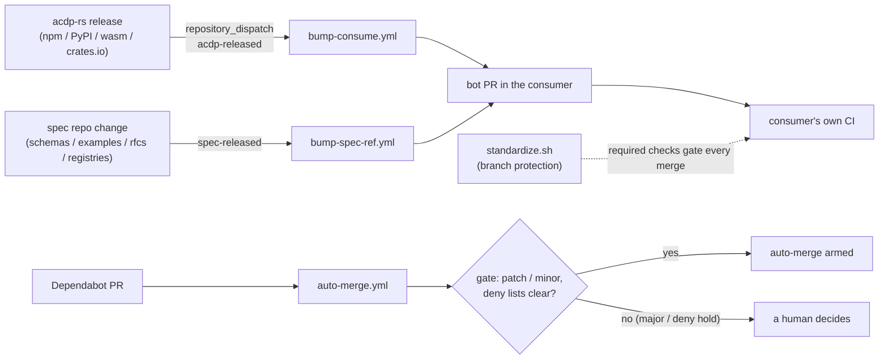

# acdp-ci

Shared CI/CD building blocks for the **acdp-\*** repositories — one place to
define how the whole org builds, propagates dependencies, and ships, so every
repo stays uniform instead of drifting.



What triggers the two dispatches is owned by the producers, not here — see the
[acdp-rs release runbook](https://github.com/agentcontextdistributionprotocol/acdp-rs/blob/main/docs/release-runbook.md)
and the spec repo's
[`notify-spec-consumers.yml`](https://github.com/agentcontextdistributionprotocol/agentcontextdistributionprotocol/blob/main/.github/workflows/notify-spec-consumers.yml).
The spec itself and its RFC process live in the
[spec repo](https://github.com/agentcontextdistributionprotocol/agentcontextdistributionprotocol)
([RFC lifecycle](https://github.com/agentcontextdistributionprotocol/agentcontextdistributionprotocol/blob/main/rfcs/README.md)).

## What's here

| Reusable workflow | Purpose |
|---|---|
| [`.github/workflows/auto-merge.yml`](.github/workflows/auto-merge.yml) | Auto-merge Dependabot PRs once required checks pass. Runs only for `dependabot[bot]`, one run per PR at a time. Patch + minor unattended; **majors held** (`allow-major: true` arms them). Optional `exclude-dependencies` / `exclude-groups` globs hold matching PRs (and disarm a stale arm). **Hard-fails** if the base branch has no required status checks — it will not arm on an ungated branch. Decision logic: [`actions/auto-merge-gate`](actions/auto-merge-gate/README.md). |
| [`.github/workflows/bump-consume.yml`](.github/workflows/bump-consume.yml) | Consume a new `acdp` SDK release: resolve version (`version` input, else event payload, else latest) → wait for the registry (24×5 s) → bump → PR on `deps/<name>-<ver>` (a no-op if that branch already exists) → arm auto-merge. 15-minute job timeout. Ecosystems: `npm` (edits the manifest, then [`npm-relock`](actions/npm-relock/README.md) waits for every platform package, relocks and verifies `npm ci --dry-run`, failing closed), `cargo` (edits `Cargo.toml`, `cargo update --precise`), `uv` (lockfile only: `uv lock --upgrade-package`; `pyproject.toml` is untouched). A 0.x minor counts as breaking; with no required checks on the base branch it **warns and skips arming** instead of failing. Inputs: `ecosystem`, `package` (default `acdp`), `version`, `node-version` (default `22`; used only when the consumer has no `.nvmrc` / `.node-version`, which wins), `allow-major`. |
| [`.github/workflows/bump-spec-ref.yml`](.github/workflows/bump-spec-ref.yml) | Adopt a new pinned ACDP spec SHA: rewrite the pinned `ref:` in the target workflow `file` (default `.github/workflows/ci.yml`) → PR on `deps/spec-<sha12>`. Inputs `file`, `spec-repo`, `sha` (blank = event payload, else spec `HEAD`). Requires **exactly one** pin anchor in the file; zero or several fail loudly. **Held, never auto-merged** — the PR's own conformance CI runs against the new fixtures, and a human adopts the new spec deliberately. |

| Composite action | Purpose |
|---|---|
| [`actions/auto-merge-gate`](actions/auto-merge-gate/README.md) | Used by `auto-merge.yml`: decides arm vs hold (outputs `eligible`, `reason`) and disarms a stale arm for deny-list holds only. |
| [`actions/npm-relock`](actions/npm-relock/README.md) | Used by `bump-consume.yml` (npm): wait for every optional platform package of the target, relock, verify `npm ci --dry-run`; restores the original lock and fails closed. Inputs `package`, `version`, `attempts`, `sleep`. |
| [`actions/checkout-spec`](actions/checkout-spec/README.md) | Check out the ACDP spec at a SHA-verified pinned ref, **inside your own job** (a `uses:` step, not a separate reusable-workflow job) — exports `ACDP_SPEC_DIR` and a `path` output. |

| Script | Purpose |
|---|---|
| [`scripts/standardize.sh`](scripts/standardize.sh) | Apply uniform branch protection to every managed repo. `allow_auto_merge` and required status checks are per-repo; zero-check repos (`acdp-ci`, `.github`) get protection only, never auto-merge. Required checks come from `checks_for()` — except `acdp-registry-rs`, whose checks and `enforce_admins` come from **its own** `.github/required-checks.json`. `--check` (alias `--dry-run`) is a read-only drift survey that mutates nothing. Exit **0** = clean; **1** = a result (drift, a declared check not yet applied, an `UNREGISTERED` org repo, an unreadable repo, or a named unmanaged repo); **2** = the check could not run (bad flags, missing dependency, config error, every repo unreadable). Fail-closed on apply: refuses to remove a live required check it doesn't declare, or to weaken a registry baseline (lower `enforce_admins`, re-pin a check to another app), unless `--allow-check-removal`. |
| [`scripts/handoff/`](scripts/handoff/README.md) | Human-run, dry-run-by-default scripts for steps an agent shouldn't execute (e.g. moving the `v1` tag). |

| This repo's own workflow (not consumable via `uses:`) | Purpose |
|---|---|
| [`.github/workflows/drift-check.yml`](.github/workflows/drift-check.yml) | Weekly (+ manual) read-only sweep **local to acdp-ci** — no `workflow_call` trigger. Runs `scripts/standardize.sh --check` across every managed repo and files/updates one tracking issue on drift, an unreadable repo, a declared-but-unapplied check, baseline weakening, or an unregistered org repo (exit 2 hard-fails the job instead). `schedule`/`workflow_dispatch` only — no `pull_request` trigger, so `acdp-ci` stays a zero-check-run repo on its own PRs. |

See **[DELIVERY-STANDARD.md](DELIVERY-STANDARD.md)** for the full model
(dependency-propagation graph, credential design, rollout).

## How a repo uses it

`auto-merge` — commit `.github/workflows/auto-merge.yml`:

```yaml
name: auto-merge
on: pull_request
permissions: { contents: write, pull-requests: write }
jobs:
  call:
    uses: agentcontextdistributionprotocol/acdp-ci/.github/workflows/auto-merge.yml@v1
```

Optional deny lists (globs; newline- or comma-separated) hold a PR even when it is
patch/minor — e.g. for crypto-critical dependencies:

```yaml
    with:
      exclude-dependencies: |
        ring
        @noble/*
      exclude-groups: crypto
```

`exclude-groups` is a convenience only: an ungrouped PR has no group, so list crypto-critical
dependencies in `exclude-dependencies`. `#` comments and blank lines in a pattern list are ignored.

Empty (the default) is exactly the policy above. A deny-list hold also **disarms**
auto-merge if it was already armed — including one a human armed by hand — whenever
Dependabot pushes or rebases the PR; a held *major* is never disarmed. `[`/`!(…)`
extglob syntax in a pattern is honoured by bash (`!(x)` holds nearly everything). Fail-safe: if a dependency deny
list is set but the PR's dependency names can't be determined, the PR is held. A
name list only sees the dependencies Dependabot set out to update, **not
transitive lockfile movement**; a repo that needs a lockfile-diff gate keeps its
own workflow. `acdp-rs` is that repo: it deliberately does **not** use this
shared workflow (its own `dependabot-auto-merge.yml` gates on a crypto-critical
lockfile diff; two workflows arming one PR is the race acdp-rs#351 removed), so
`standardize.sh` does not manage it and nothing here should re-add the shared
caller there.

`bump-acdp` (consumers only) — commit `.github/workflows/bump-acdp.yml`:

```yaml
name: bump acdp
on:
  repository_dispatch: { types: [acdp-released] }
  workflow_dispatch:   { inputs: { version: { required: false, default: '' } } }
jobs:
  bump:
    uses: agentcontextdistributionprotocol/acdp-ci/.github/workflows/bump-consume.yml@v1
    with:  { ecosystem: npm, package: '@agentcontextdistributionprotocol/acdp' }  # cargo|uv per repo
    secrets:
      ACDP_BOT_APP_ID: '${{ secrets.ACDP_BOT_APP_ID }}'
      ACDP_BOT_PRIVATE_KEY: '${{ secrets.ACDP_BOT_PRIVATE_KEY }}'
```

`bump-spec` (spec-pinning consumers only) — commit `.github/workflows/bump-spec.yml`:

```yaml
name: bump spec
on:
  repository_dispatch: { types: [spec-released] }
  workflow_dispatch:   { inputs: { sha: { required: false, default: '' } } }
jobs:
  bump:
    uses: agentcontextdistributionprotocol/acdp-ci/.github/workflows/bump-spec-ref.yml@v1
    with:  { file: .github/workflows/ci.yml, sha: '${{ github.event.inputs.sha }}' }
    secrets:
      ACDP_BOT_APP_ID: '${{ secrets.ACDP_BOT_APP_ID }}'
      ACDP_BOT_PRIVATE_KEY: '${{ secrets.ACDP_BOT_PRIVATE_KEY }}'
```

`checkout-spec` (spec-pinning consumers only) — a step inside your own CI job, **after** your
own repo's checkout. Usage, inputs, outputs and the ordering rule live in the
[action's README](actions/checkout-spec/README.md); the adoption recipe and the SHA-pin ruling
are in [DELIVERY-STANDARD.md](DELIVERY-STANDARD.md).

## Credentials

The only cross-repo credential is the `acdp-deps-bot` GitHub App (org secrets
`ACDP_BOT_APP_ID` / `ACDP_BOT_PRIVATE_KEY`); workflows mint a short-lived installation token
from it. No PATs. The permission table and per-workflow token scopes are in
[DELIVERY-STANDARD.md](DELIVERY-STANDARD.md#credentials).

## Conventions

- Third-party actions are **SHA-pinned**; GitHub's own `actions/*` (the `actions` org) use major tags.
- Pin callers to a release tag (`@v1`), not `@main` — for the reusable
  *workflows* (`bump-consume.yml`, `bump-spec-ref.yml`, `auto-merge.yml`).
  The `checkout-spec` *action* is the documented exception: it MUST be
  SHA-pinned (with a trailing `# v1` comment), not tag-pinned — see the
  Ruling in the "Spec propagation" section of
  [DELIVERY-STANDARD.md](DELIVERY-STANDARD.md).

## Tests

Three offline bash harnesses (`tests/standardize`, `tests/auto-merge`, `tests/bump-npm`);
see [`tests/README.md`](tests/README.md). They are **not** wired into CI — run them locally
before changing `scripts/`, `actions/` or `.github/workflows/`.

## Repository layout

| Path | What it is |
|---|---|
| `.github/workflows/` | the three reusable workflows + the local `drift-check.yml` |
| `.github/dependabot.yml` | monthly, grouped updates for this repo's own `uses:` pins (root and `actions/checkout-spec`) |
| `actions/` | composite actions (each with a README) |
| `scripts/` | `standardize.sh`, `handoff/` |
| `tests/` | the harnesses above |
| `DELIVERY-STANDARD.md` | the org delivery standard |
| `ASSUMPTIONS.md`, `DECISIONS.md` | the decision ledger (assumptions logged while building; what was confirmed, changed or deferred) |
| `plans/cross-repo/` | plans written here for another repo to pick up |
