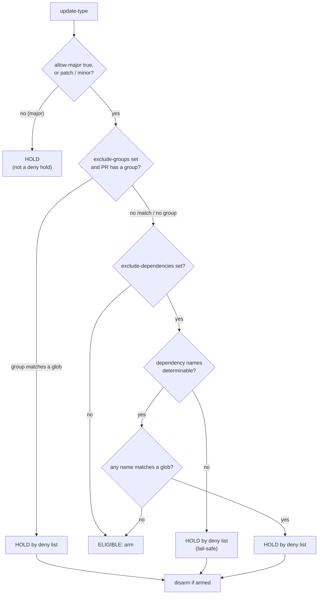

# `auto-merge-gate`

Composite action used by [`auto-merge.yml`](../../.github/workflows/auto-merge.yml). It
decides whether the shared workflow may **arm** auto-merge on a Dependabot PR, and
**disarms** an already-armed PR when a deny list holds it. It makes no other change.

The decision logic is [`decide.sh`](decide.sh); the disarm step is
[`disarm.sh`](disarm.sh). Both are covered offline by
[`tests/auto-merge`](../../tests/auto-merge/run.sh).

## Decision

- With both deny lists empty the rule is exactly "arm on patch/minor, hold majors".
- Deny lists only ever **add** holds. A hold by the major rule is *never* disarmed (a human
  may have armed a major on purpose); only deny-list holds disarm.
- Fail-safe: if `exclude-dependencies` is set but the PR's dependency names cannot be read
  from `updated-dependencies-json` (or the `dependency-names` fallback), the PR is held.
- A name list sees only the dependencies Dependabot set out to update, **not transitive
  lockfile movement**. A repo that needs a lockfile-diff gate keeps its own workflow
  (`acdp-rs` does).

## Inputs

| Input | Required | Default | Purpose |
|---|---|---|---|
| `update-type` | yes | | `dependabot/fetch-metadata` `update-type` output. |
| `dependency-group` | no | `''` | `fetch-metadata` `dependency-group` output. |
| `updated-dependencies-json` | no | `''` | `fetch-metadata` `updated-dependencies-json` output (preferred source of names). |
| `dependency-names` | no | `''` | `fetch-metadata` `dependency-names` (comma separated); fallback when the JSON yields none. |
| `allow-major` | no | `false` | Arm even on a major bump. |
| `exclude-dependencies` | no | `''` | Newline/comma separated globs; a PR updating a matching dependency is held. |
| `exclude-groups` | no | `''` | Newline/comma separated globs matched against the Dependabot group. **A convenience only**: an ungrouped PR has no group, so list crypto-critical crates in `exclude-dependencies`. |
| `pr-url` | yes | | PR `html_url`, for the disarm step. |
| `github-token` | yes | | Token for `gh` (`pull-requests: write`). |

Pattern syntax: bash `[[ x == $pattern ]]` globs. `#` comments and blank lines are
stripped, and CR / CRLF count as line breaks. Extglob `!(…)` is honoured by bash (and
`!(x)` holds nearly everything).

## Outputs

| Output | Meaning |
|---|---|
| `eligible` | `'true'` if auto-merge may be armed. |
| `reason` | Human-readable why, for the job log. |

(`decide.sh` also emits `held_by_deny` to `$GITHUB_OUTPUT`; it is consumed inside this
action by the disarm step and is **not** an action output.)
