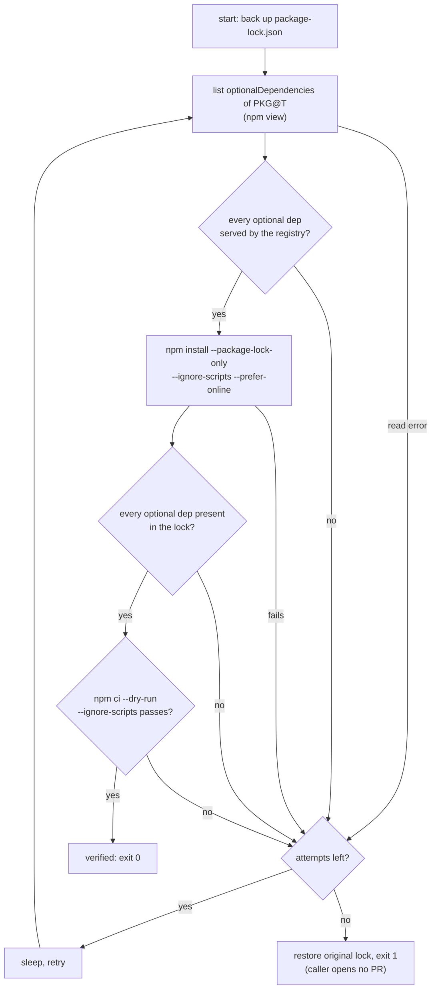

# `npm-relock`

Composite action used by [`bump-consume.yml`](../../.github/workflows/bump-consume.yml)
for the `npm` ecosystem. After the bump rewrote `package.json` to `PKG@T`, it relocks and
**fails closed** if the resulting `package-lock.json` is not installable. The logic is
[`relock.sh`](relock.sh); it is exercised offline by
[`tests/bump-npm`](../../tests/bump-npm/run.sh).

## Why

A release publishes the main package before its platform packages
(`optionalDependencies`). `npm install --package-lock-only` run in that window exits 0 and
silently leaves the not-yet-published optional deps out of the lock, so the bot PR then
fails `npm ci` in the consumer (acdp-ci#28). This action waits for them and verifies.

## Flow

On **any** exit that did not verify — including an unexpected crash — the original lockfile
is restored, so the caller can never open a PR from a broken lock. Presence in the lock is
checked by name only (the lock may legitimately resolve a newer in-range version);
`npm ci --dry-run` is the authoritative check. `npm:real@range` alias specs are looked up as
`real@range`.

## Inputs

| Input | Required | Default | Purpose |
|---|---|---|---|
| `package` | yes | | SDK package name as it appears in the consumer manifest. |
| `version` | yes | | Target version already written into `package.json`. |
| `attempts` | no | `12` | Max relock/verify attempts. |
| `sleep` | no | `15` | Seconds between attempts (≈ 3 min total at the defaults). |

No outputs; success is exit 0, failure is exit 1 with an `::error::` annotation.
